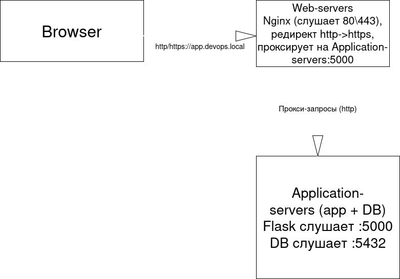

# Flask-приложение с Ansible-развёртыванием

## Требования к системе

### Локальная машина (Ansible Controller)

- **Операционная система**: Linux, macOS или Windows (с WSL)
- **Ansible**: версия 2.10 или выше
- **Python**: версия 3.8 или выше
- **SSH-клиент**
- **Доступ к интернету**
- **Свободное место на диске**: ~2 ГБ

### Виртуальные машины (2 шт.)

- **Операционная система**: Ubuntu 22.04 LTS (Server)
- **Сетевой режим**: Bridged
- **Минимальные ресурсы на ВМ**:
  - CPU: 1 ядро
  - RAM: 1 ГБ
  - HDD: 10 ГБ
- **Пользователь**: `devops` с правами `sudo`
- **Порт 22 (SSH)**: должен быть открыт на обеих ВМ

> **Примечание**: Пароль `1976` используется для доступа к зашифрованным данным и БД.

## Сетевые настройки

1. Узнайте IP-адреса обеих ВМ с помощью команды:
   `hostname -I`.
2. Обновите следующий файл:
   - `inventory.ini` - укажите актуальные IP-адреса ВМ.
3. На хостовой машине добавьте запись в файл `/etc/hosts`:
   - `<Web_server_ip> app.devops.local` - где <Web_server_ip> — IP-адрес второй виртуальной машины (Web Server).

## Пошаговая инструкция по развертыванию:

1. Создайте 2 виртуальные машины с `Ubuntu 22.04 LTS Server` и в настройках сети добавьте сетевой мост.
2. При создании двух VM (можно позже отдельно) создайте пользователя `devops`.
3. Убедитесь, что пользователь имеет права `sudo`.
4. По умолчанию порт 22 открыт без UFW, но если установлен, то откройте.
5. С помощью команды `hostname -I` узнайте IP-адреса двух VM и впишите, как сказано в пункте с сетевыми настройками.
6. Создайте на своей машине ssh ключи с помощью команд:
    - `ssh-keygen -t rsa -b 4096 -C "devops@vm1" -f ~/.ssh/id_rsa_vm1`.
    - `ssh-keygen -t rsa -b 4096 -C "devops@vm2" -f ~/.ssh/id_rsa_vm2`.
7. Далее скопируйте эти ключи на виртуальные машины с помощью команд:
    - `ssh-copy-id -i ~/.ssh/id_rsa_vm1.pub devops@(ip vm1)`.
    - `ssh-copy-id -i ~/.ssh/id_rsa_vm2.pub devops@(ip vm2)`.
8. На основном хосте склонируйте репозиторий https://github.com/PannaKoccu/panna.git и зайдите в папку ansible1 в терминале.
9. Далее в терминале вставьте команду:
    - `ansible-playbook playbooks/site.yml --ask-become-pass --ask-vault-pass`. Введите пароль от sudo и пароль от vault (1976).
10. Когда проект развернулся на виртуальных машинах, нужно зайти на сервер с приложением и запустить скрипт `test-deployment.sh`, он будет много раз спрашивать пароль от БД, вводим (1976). Этот скрипт нужен для полной проверки всего проекта, включая базу данных, её бекапы и восстановление из бекапов.

## Повторный запуск и обновления:

Также существует playbook для обновления приложения. Запускается командой:

- `ansible-playbook playbooks/update.yml --ask-vault-pass`.


## Структура проекта

```
.
├── ansible.cfg
├── CHECKLIST.md
├── docs
│   └── Diagram.png
├── group_vars
│   ├── all.yml
│   ├── Application_servers
│   │   └── vault.yml
│   └── Web_servers
│       └── vault.yml
├── inventory.ini
├── playbooks
│   ├── deploy.yml
│   └── site.yml
├── README.md
└── roles
    ├── application
    │   ├── handlers
    │   │   └── main.yml
    │   ├── tasks
    │   │   └── main.yml
    │   └── templates
    │       ├── env.j2
    │       └── task1.service.j2
    ├── common
    │   ├── handlers
    │   │   └── main.yml
    │   └── tasks
    │       └── main.yml
    ├── database
    │   ├── handlers
    │   │   └── main.yml
    │   ├── tasks
    │   │   └── main.yml
    │   └── templates
    │       └── pg_hba.conf.j2
    ├── monitoring
    │   ├── tasks
    │   │   └── main.yml
    │   └── templates
    │       ├── healthcheck.sh.j2
    │       └── test-deployment.sh.j2
    ├── scripts
    │   ├── tasks
    │   │   └── main.yml
    │   └── templates
    │       ├── backup.sh.j2
    │       └── setup.sh.j2
    ├── update
    │   └── tasks
    │       └── main.yml
    └── webserver
        ├── handlers
        │   └── main.yml
        ├── tasks
        │   └── main.yml
        └── templates
            └── app.devops.local.conf.j2

```

- Директория `group_vars`: Содержит директории `Application_servers` и `Web_servers`, в них файлы `vault.yml`. Эти файлы содержат секреты, такие как пароль от БД и ключ. Также в директории group_vars есть файл `all.yml` - это общие переменные для всех VM.

- Директория `playbooks` содержит playbook `site.yml` для полной настройки сервера и `deploy.yml` для обновления приложения.

- Файл `ansible.cfg` содержит базовую настройку ansible (пути к ролям, inventory и тд.)

- Файл `inventory.ini` содержит пути к ключам, IP виртуальных машин.

## Описание ролей:

### common

#### Назначение

Базовая настройка ОС на всех серверах.

#### Функционал

- Настройка SSH: отключение входа по паролю и от root.
- Установка базовых пакетов (`curl`, `git`, `python3-pip` и др.).
- Настройка и включение UFW.

#### Handlers

- Restart SSH — перезапуск SSH после изменения конфига.

### database

#### Назначение

Установка и настройка базы данных.

#### Функционал

- Установка PostgreSQL и её зависимостей.
- Проверяет, что БД запущена.
- Создаёт кластер для работы БД.
- Копируем шаблон `pg_hba.conf`.
- Изменяем файл конфигурации БД.
- Создаём пользователя БД
- Создаём БД.

#### Используемые переменные

- db_password
- db_user
- postgresql_log_dir
- db_config
- db_pg_hba
- db_name

#### Handlers

- Restart PostgreSQL

#### Templates

- pg_hba.conf.j2

### application

#### Назначение

Клонируем и настраиваем сам сайт.

#### Функционал

- Создание директории под приложение.
- Клонирование репозитория с приложением.
- Создание виртуального окружения в определённой директории и установка внутрь него `pip`.
- Создаём `.env` файл для приложения.
- Создаём директорию для логов.
- Копируем шаблон `task1.service.j2`.
- Запускаем сервис (приложение).

#### Используемые переменные

- app_dir
- venv_dir
- db_user
- db_password
- db_name
- log_dir
- app_log_file
- systemd_service

#### Handlers

- Restart task1.

#### Templates

- env.j2
- task1.service.j2

### webserver

#### Назначение

Установка и настройка Nginx с самоподписанным сертификатом.

#### Функционал

- Установка Nginx.
- Создание директории под SSL и приватного ключа.
- Создаёт запрос на подпись сертификата.
- На основе CSR и приватного ключа создаёт самоподписанный SSL-сертификат.
- Копируем шаблон `app.devops.local.conf.j2`.
- Включение виртуального хоста.
- Удаление стандартного сайта.
- Создание директории для логов Nginx.

#### Используемые переменные

- ssl_dir
- selfsigned_key
- selfsigned_csr
- selfsigned_crt
- nginx_conf_way
- domain_name
- nginx_vh_way
- nginx_default_site
- nginx_log_dir
- app_server_ip
- nginx_ip
- app_port

#### Handlers

- Restart Nginx

#### Templates

- app.devops.local.conf.j2.

### scripts

#### Назначение

Копирование скриптов, создание директории для логов и настройка cron на бекап.

#### Функционал

- Создание директории под логи скриптов и бекапы.
- Копирует шаблоны `setup.sh` и `backup.sh`.
- Устанавливает `cron` на бекап.

#### Используемые переменные

- app_dir
- venv_dir
- db_name
- db_user
- backup_dir
- script_backup_log
- script_setup_log

#### Templates

- setup.sh.j2
- backup.sh.j2

### monitoring

#### Назначение

Копирование скриптов `healthcheck.sh` и `test-deployment.sh`. Настройка `logrotate`.

#### Функционал

- Копирует на `Web_servers` скрипт `healthcheck.sh`.
- Настраивает `cron` для `healthcheck.sh`.
- Создаём на всех VM конфиги logrotate.
- Копируем скрипт `test-deployment.sh`.

#### Используемые переменные

- app_dir
- db_name
- db_user
- db_password
- app_server_ip
- nginx_ip
- app_port
- backup_dir
- healthcheck_log
- home_dir
- logrotate_app_log_path
- logrotate_app_config_dest
- logrotate_scripts_log_path
- logrotate_scripts_config_dest
- logrotate_db_log_path
- logrotate_db_config_dest

#### Templates

- healthcheck.sh.j2
- test-deployment.sh.j2

### update

#### Назначение

Обновление приложения.

#### Функционал

- Клонирование репозитория с приложением.
- установка зависимостей из файла.


## Архитектура системы



*Рисунок 1: Схема развертывания приложения*